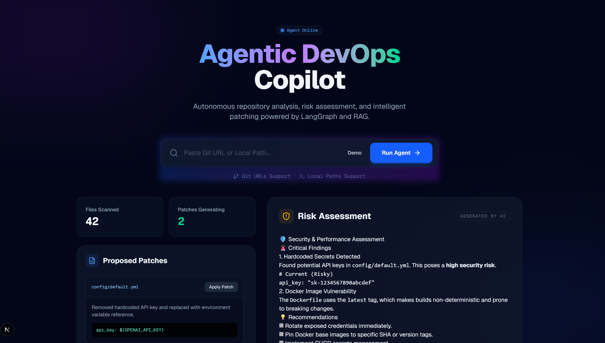

# Agentic DevOps Copilot 🤖🚀


> **Autonomous multi-agent system for repository analysis, security risk assessment, and intelligent patch generation.**



## 📖 Overview

**Agentic DevOps Copilot** is a next-generation developer tool that uses **LangGraph** agents and **Retrieval-Augmented Generation (RAG)** to autonomously inspect your codebase. It doesn't just find problems; it understands context, assesses risks, and proposes code patches.

### Key Capabilities

*   **🕵️‍♂️ Autonomous Repo Analysis**: Parses file structures (AST) and understands dependencies.
*   **🛡️ Security Risk Assessment**: Detects hardcoded secrets, Docker vulnerabilities, and misconfigurations.
*   **🧠 RAG-Powered Context**: Uses **Qdrant** vector search to answer questions based on your specific codebase.
*   **⚡ Intelligent Patching**: Generates ready-to-merge fixes for identified issues.
*   **✨ Modern Dashboard**: A glassmorphic Next.js UI for interactive chat and report visualization.

---

## 🛠️ Technology Stack

| Component | Tech | Description |
| :--- | :--- | :--- |
| **Orchestration** | **LangGraph** | Multi-step agent state management and loops. |
| **Backend** | **FastAPI** | High-performance Python API. |
| **Frontend** | **Next.js 14** | App Router, Server Actions, Framer Motion. |
| **Vector DB** | **Qdrant** | Semantic search for code and documentation. |
| **LLM** | **OpenAI** | GPT-4o / GPT-3.5-Turbo for reasoning. |
| **Tools** | **MCP** | Model Context Protocol for tool standardization. |

---

## 🚀 Getting Started

### Prerequisites

*   Python 3.11+
*   Node.js 20+
*   Docker & Docker Compose
*   OpenAI API Key

### 1. Start Infrastructure (Vector DB)
```bash
docker-compose up -d
```

### 2. Configure Environment
Create a `.env` file in the root directory:
```env
OPENAI_API_KEY=sk-your-key-here
QDRANT_HOST=localhost
QDRANT_PORT=6333
QDRANT_COLLECTION_NAME=devops_copilot
```

### 3. Start Backend
```bash
# Create virtual environment (optional but recommended)
python -m venv venv
.\venv\Scripts\activate

# Install dependencies
pip install -r requirements.txt

# Run the API Server
python -m uvicorn app.main:app --reload
```
*Backend runs on `http://localhost:8000`*

### 4. Start Frontend
```bash
cd frontend
npm install
npm run dev
```
*Frontend runs on `http://localhost:3000`*

---

## 🎮 Usage

1.  Open the dashboard at `http://localhost:3000`.
2.  **Analyze a Repo**: Paste a local path (e.g., `C:/Projects/MyApp`) or a GitHub URL.
3.  **Demo Mode**: Click the **"Demo"** button in the search bar to simulate a full security scan with sample data.
4.  **Review Risks**: Check the "Risk Assessment" card for critical findings.
5.  **Apply Patches**: Review generated code fixes for vulnerabilities.

---

## 🛣️ Roadmap

- [x] Repo Parsing & Structure Analysis
- [x] Basic Security Risk Agent
- [x] RAG Pipeline with Qdrant
- [x] Glassmorphic UI Dashboard
- [ ] Integration with GitHub Issues / PRs
- [ ] Support for Local LLMs (Ollama)
- [ ] Kubernetes Manifest Validation

---

## 📄 License

This project is licensed under the MIT License - see the [LICENSE](LICENSE) file for details.
